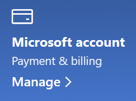

# Ændre mine Microsoft-kontooplysninger

Gå til [https://account.microsoft.com](https://account.microsoft.com/) og log på, hvis det er nødvendigt. Dette fører dig til dit konto Dashboard.  

**Rediger mit navn og personlige oplysninger**

1. På dit konto Dashboard skal du ud for dit kontobillede og navn klikke på **flere handlinger > Rediger profil**.
2. På siden **Rediger profil** skal du bruge linkene til at ændre dit profilbillede, navn, dato for fødselsdato, placering og visningssprog. Bemærk links til dine Xbox-eller Skype-kontoprofiler, hvor du kan ændre detaljer, der er specifikke for disse konti.

**Administrere mailadresser og telefonnumre**

En Microsoft-konto har en eller flere e-mail-adresser eller telefonnumre, der er knyttet til det som "aliaser". Sådan administreres disse:

1. På dit konto Dashboard skal du ud for dit kontobillede og navn klikke på **flere handlinger > Rediger profil**.
2. Klik på **Administrer, hvordan du logger på Microsoft**, på siden **Rediger profil** . 
3. Du får vist en liste over konto aliasser, og du kan administrere listen, herunder tilføje og slette mailadresser og telefonnumre. Her kan du også vælge, hvilke aliasser der kan bruges til at logge på kontoen, og hvilket alias opfattes som "primær", som vises på din Windows 10-enhed.

**Administrere betalingsmetoder samt navn og adresse til fakturering** 

1. På dit konto Dashboard skal du ud for dit kontobillede og navn klikke på **flere handlinger > Rediger profil**.
2. Klik på **Administrer**Under **betaling & fakturering** .

    

3. Her kan du tilføje, redigere og fjerne betalingsmetoder og deres tilknyttede faktureringsadresser. 
