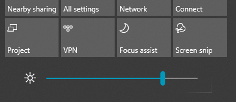

# Ændre skærmens lysstyrke i Windows 10Change screen brightness in Windows 10

Hvis din Windows 10 er nyere end version 1903, har det en **lysstyrke skyder** i handlingscenter.If your Windows 10 is newer than version 1903, it has a **Brightness slider** in the action center. Hvis du vil åbne Løsningscenter, skal du klikke på **meddelelses** knappen i højre side af proceslinjen, eller du kan trykke på **Windows Home + A** på tastaturet.To open the action center, click the **Notification** button at the rightmost side of your taskbar, or press **Windows home + A** on your keyboard.

Hvis din Windows 10 er en tidligere version, kan du finde skyderen lysstyrke ved at gå til **[indstillinger > System > vises](ms-settings:display?activationSource=GetHelp)**.If your Windows 10 is an earlier version, you can find the brightness slider by going to **[Settings > System > Display](ms-settings:display?activationSource=GetHelp)**.

**Bemærkninger**:**Notes**:

- Du kan muligvis ikke se ændrings lysstyrke for den indbyggede skærm skyder på stationære computere, der har en ekstern skærm.You might not see the Change brightness for the built-in display slider on desktop PCs that have an external monitor. Hvis du vil ændre lysstyrken på en ekstern skærm, skal du bruge kontrolelementerne på skærmen.To change the brightness of an external monitor, use the controls on the monitor.
- Hvis du ikke har en stationær computer, og skyderen ikke vises eller virker, kan du prøve at opdatere skærmdriveren.If you don't have a desktop PC and the slider doesn't appear or work, try updating the display driver. Skriv **Enhedshåndtering**i søgefeltet på proceslinjen, og vælg derefter **Enhedshåndtering** på listen over resultater.In the search box on the taskbar, type **Device Manager**, and then select **Device Manager** from the list of results. I **Enhedshåndtering**skal du vælge **skærmkort**og derefter vælge skærmkortet.In **Device Manager**, select **Display adapters**, then select the display adapter. Tryk på og hold (eller højreklik) på navnet på den viste adapter, og klik på **Opdater driver**; Følg derefter vejledningen.Press and hold (or right-click) the display adapter name and click **Update driver**; then follow the instructions.
