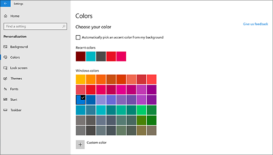
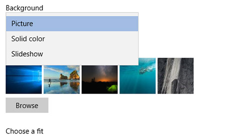

# Skift baggrund og farver på skrivebordetChange your desktop background and colors

Hvis du vil ændre farveindstillingen, skal du gå til **Start** indstillinger Tilpasningsfarver og derefter vælge din egen farve eller lade Windows trække en  >    >    >  farve fra baggrunden.To change your colors setting, go to **Start** > **Settings** > **Personalization** > **Colors**, and then choose your own color or let Windows pull an accent color from your background.

Hvis du vil ændre baggrunden på skrivebordet, skal du gå til **Start** Indstillinger Tilpasningsbaggrund og derefter vælge et billede, en dækkende farve eller oprette  >    >    >  et slideshow med billeder.To change your desktop background, go to **Start** > **Settings** > **Personalization** > **Background**, and then choose a picture, solid color, or create a slideshow of pictures. 

Vil du have flere baggrunde og farver på skrivebordet?Want more desktop backgrounds and colors? Besøg [Microsoft Store for](https://www.microsoft.com/store/collections/windowsthemes) at vælge mellem masser af gratis temaer.Visit [Microsoft Store](https://www.microsoft.com/store/collections/windowsthemes) to choose from dozens of free themes.
