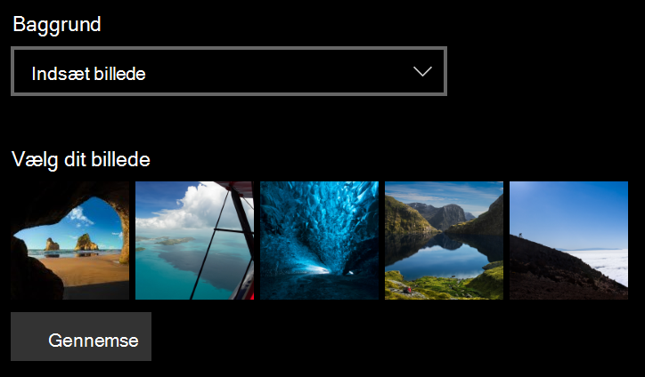
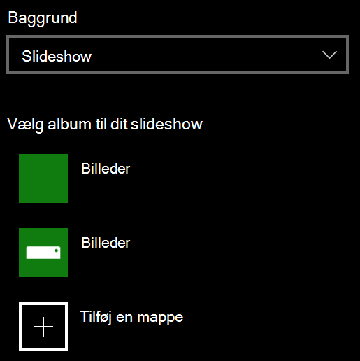

# Ændre baggrunden for din låseskærmChange your lock screen background

- Gå til **Indstillinger**  >  **Personlig tilpasning**  >  **Låseskærm**.Go to **Settings** > **Personalization** > **Lock screen**. Eller klik eller tryk [her](ms-settings:lockscreen?activationSource=GetHelp).Or click or tap [here](ms-settings:lockscreen?activationSource=GetHelp).

- Hvis du vil angive et brugerdefineret **baggrundsbillede,** **skal** du vælge Billede på rullelisten Baggrund og vælge **eller** Gennemse til billedet.To set a custom background picture, select **Picture** from the **Background** drop-down list, and choose or **Browse** to the picture.

  

- Hvis du vil konfigurere et slideshow med  brugerdefinerede billeder, skal du vælge **Slideshow** på rullelisten Baggrund og vælge et album eller tilføje en mappe, der indeholder billederne til slideshowet.To set up a slideshow of custom pictures, select **Slideshow** from the **Background** drop-down list, and choose an album or add a folder that contains the pictures for the slideshow.

  
