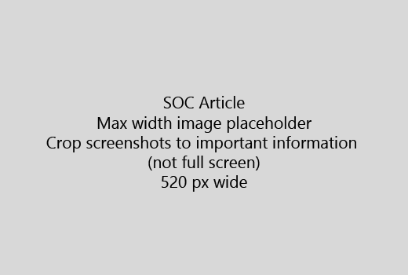

Start din artikel med en meget kort introduktion (1 punktum). Sætte dig selv i læserens sted - Hvorfor er de her? Hvad gør de?Start your article with a very short introduction (1 sentence). Put yourself in the reader's place - why are they here? What should they do? 
  
1. Gå direkte til en hurtig oversigt over trin for at udføre opgaven.Get straight to a quick list of steps to accomplish the task.
    
    Hvis du har brug at forklare et begreb, eller de har at gøre forhånd nødvendige trin, kan du tilføje en hurtig oversigt under det trin, hvor de har brug for det og [link](https://support.office.com/article/f37e7984-cf03-4fde-92d3-82970d7e241b.aspx) til begrebet eller trin.If you need to explain a concept, or they have to do pre-requisite steps, add a quick summary below the step where they need it, and [link](https://support.office.com/article/f37e7984-cf03-4fde-92d3-82970d7e241b.aspx) to the concept or steps. 
    
2. Holde procedurer kort - helst 5 eller færre trin, mere end 8.Keep procedures short - preferably 5 or fewer steps, no more than 8.
    
3. Brug **format til brugergrænsefladen** for elementer på brugergrænsefladen eller for tekst, brugerne skal angive.Use **Ui style** for user interface elements or for text people need to enter. 
    
4. Brug verberne vælge, vælger, eller Angiv som aktioner og formatere menuer som **i menuen** \> **kommando**.Use the verbs choose, select, or enter as actions, and format menus as **Menu** \> **Command**.
    
5. Tilføj eventuelt et skærmbillede for kontekst (hvis Brugergrænsefladen er svært at finde, eller der er behov at fuldføre opgaven).Optionally, add a screenshot for context (if UI is hard to locate, or it's needed to complete the task).
    
    Største bredde: 520 pixel. Brug en standard tema, ikke vise personlige oplysninger, og Beskær for at vise kun, hvad der er relevant.Maximum width: 520 pixels. Use a standard theme, do not show any personal information, and crop to show only what's relevant. 
    
    
  
Hvis du vil tilføje en video eller et skærmbillede, bruge et gitter med to kolonner og have trinnene i venstre og video eller skærmbillede til højre - se [Eksempel på video gitter og trin](https://support.office.com/article/14ce8e82-efa0-47f5-bb84-94f078db3dae.aspx).If you want to add a video or screenshot, use a two-column grid and have the steps in the left and the video or screenshot in the right - see [Steps and video grid example](https://support.office.com/article/14ce8e82-efa0-47f5-bb84-94f078db3dae.aspx). 
  
Fokusere på mere end 500 ord for en artikel.Target no more than 500 words for an article.
  
# Eksempel-artikelExample article

[Ændre mit fotoChange my photo](https://support.office.com/article/555376e0-1fca-49ba-8434-307a0525c767.aspx)
  

