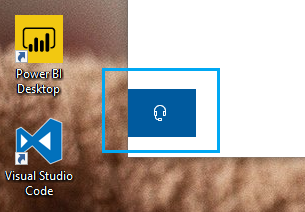

# Kontakt os ved at klikke på hovedtelefonknappen

Hvis du vil kontakte Microsoft Support, skal du klikke på **Kontakt os** i nederste venstre hjørne af denne app. Inde i fly-out vinduet, vil du blive guidet til den rigtige støtte kanal efter at have valgt dit produkt og problem kategori.

Du kan fortsætte med at interagere med resten af appen, selv efter at du har startet en Kontakt os-session. Panelet Kontakt os kan minimeres midlertidigt ved at klikke andre steder i appen. Hvis du vil vende tilbage til den samme session, skal du blot klikke på **Kontakt os** igen.
