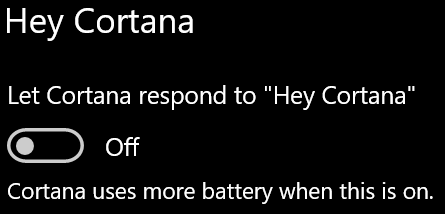

# Cortana taler ikke til mig eller kan ikke høre mig

Hvis du forsøger at bruge funktionen "Hey Cortana", som giver dig mulighed for at tale med Cortana uden at vælge Cortana-knappen på proceslinjen eller mikrofonknappen i Cortana-panelet, skal du bekræfte, at funktionen er aktiveret:

1. Gå til **Start**, og vælg **[derefter Indstillinger > Cortana](ms-settings:cortana?activationSource=GetHelp)**.
2. Under **Hey Cortana** skal du slå **til/fra-knappen Lad Cortana reagere på "Hey Cortana"** **til Til.**

**Forhindrer dine indstillinger for beskyttelse af personlige oplysninger Cortana i at høre dig?**

Dine indstillinger for beskyttelse af personlige oplysninger kan forhindre Cortana i at svare på din stemme.
- Kontrollér, at Online talegenkendelse er slået til:
    - Gå til **Start**, og klik derefter på **[Indstillinger > Indstillinger > Tale](ms-settings:privacy-speech?activationSource=GetHelp)**.
    - Under **Online talegenkendelse** skal du skifte indstillingen til **Til**.
- Kontrollér, at Cortana har tilladelse til at få adgang til din mikrofon. 
    - Gå til Start, og klik derefter på **[Indstillinger > indstillinger > Mikrofon](ms-settings:privacy-microphone?activationSource=GetHelp)**.
    - Under **Vælg, hvilke apps der** kan få adgang til din mikrofon skal du se efter **Cortana** på listen over apps og tjenester og sørge for, at knappen er slået **Til.**

Desuden skal du sørge for, at dine højttalere eller mikrofoner er opad og fungerer for at tale med Cortana.
