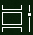

# Få mere ud af multitasking i Windows 10Do more with multitasking in Windows 10

Hvis du vil se eller skifte  mellem apps: Du kan klikke på knappen Opgavevisning på proceslinjen eller trykke **på Alt-tabulatortastaturet** på tastaturet.To see or switch between apps: you can click the **Task View** button in the taskbar, or press **Alt-Tab** on your keyboard. Knappen Opgavevisning ser sådan ud:The Task View button looks like this:

Du kan nemt arrangere to apps side om side ved hjælp af Fastgør hjælpe: tag fat i toppen af et appvindue, og træk det til den ene side for at "fastgøre" den til den halvdel af skærmen.To easily arrange two apps side by side, use Snap Assist: grab the top of an app window and drag it to one side to "snap" it to that half of the screen. Vælg derefter en anden app, så fastgøres den automatisk på plads i den anden halvdel af skærmen.Then choose another app and it will automatically snap into place in the other half of the screen.

**Sådan opretter du forskellige virtuelle skriveborde til hjemmet og arbejdet:****To create different virtual desktops for home and work**:

1. Klik på **knappen Opgavevisning** på proceslinjen, eller tryk på **Alt-tabulatortastaturet** på tastaturet.Click the **Task View** button in the taskbar, or press **Alt-Tab** on your keyboard.
2. Klik **på + Nyt skrivebord** (findes øverst til venstre på skærmen, mens du er i opgavevisning).Click **+ New Desktop** (located at the top left of your screen while in task view).
3. Åbn de apps, du vil bruge.Open the apps you want to use. 

Gå tilbage til **Opgavevisning for** at se dine skriveborde og skifte mellem dem.Go back to **Task View** to see your desktops and switch between them.
