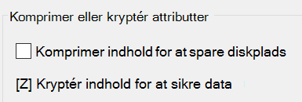

# Kryptér filer eller mapper i Windows 10

Du kan kryptere en hel disk ved hjælp af BitLocker, men kun kryptere individuelle filer eller mapper (og deres indhold):

1. I **Stifinder** skal du vælge de filer/mapper, du vil kryptere. I dette eksempel er to filer markeret:

    

2. Højreklik på de markerede filer, og klik på **Egenskaber**.

3. Klik på **Avanceret** i vinduet **Egenskaber.**

4. I vinduet **Avancerede egenskaber skal** du markere afkrydsningsfeltet **Kryptér indhold for at sikre data:**

    

5. Klik på **OK**.
