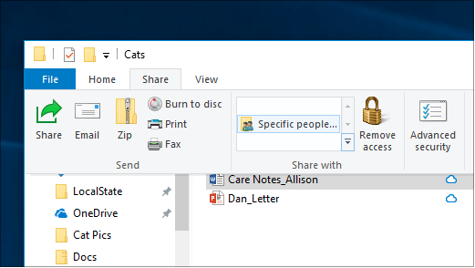
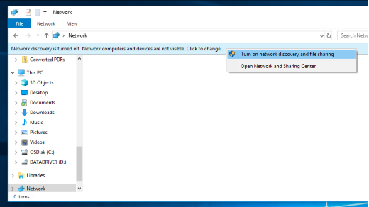

# Fildeling via et netværk i Windows 10

**Bemærk**! hvis du tidligere har brugt Hjemmegruppe til fildeling, skal du være opmærksom på, at hjemmegruppen er blevet fjernet fra Windows 10 (version 1803). Du kan nu dele printere og filer ved hjælp af indbyggede funktioner i Windows 10.

**Sådan deler du filer eller mapper via et netværk**

- I **Stifinder**skal du vælge en fil > klikke på fanen **del** øverst > i sektionen **del med** , klik på **bestemte personer**.

    
          
- Hvis du markerer flere filer på én gang, kan du dele dem alle på samme måde. Det fungerer også for mapper.

**Sådan får du vist enheder på det netværk, der deler filer**

- I **Stifinder**skal du gå til **netværk**. Hvis netværksregistrering ikke er aktiveret, får du vist en fejlmeddelelse om, at netværksgenkendelse er slået fra... "

- Klik på **netværksgenkendelse er slået fra** , og klik derefter på **Slå netværksregistrering og fildeling til**.

    

[Læs mere om fildeling via et netværk](https://support.microsoft.com/help/4092694/windows-10-file-sharing-over-a-network)

[Del filer ved hjælp af apps, OneDrive, mails og meget mere](https://support.microsoft.com/help/4027674/windows-10-share-files-in-file-explorer)
