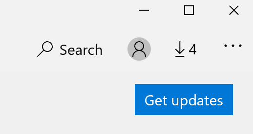

# Ret visningssproget for appsFix the display language of apps

Når du har ændret visningssproget i Windows 10, kan nogle apps stadig bruge det forrige sprog, når du åbner dem.After you change the display language in Windows 10, some apps may still use the previous language when you open them. Dette sker, fordi nye versioner af appsene for det pågældende sprog skal downloades fra store.This happens because new versions of the apps for that language must be downloaded from the Store. For at løse dette problem kan du enten vente på den automatiske opdatering, eller du kan installere den opdaterede version af appsene manuelt.To fix this problem, you can either wait for the automatic update, or you can manually install the updated version of the apps.

Hvis du vil installere opdateringen manuelt, skal du åbne **Microsoft store** og klikke på **overførsler og opdateringer** i øverste højre hjørne.To manually install the update, open **Microsoft Store** and click **Downloads and updates** in the top right corner. Klik derefter på **Hent opdateringer**.Then click **Get updates**. Hvis sproget ikke ændres, efter at opdateringen er fuldført, kan du prøve at genstarte din PC.If the language is not changed after the update is complete, try restarting your PC.

Hvis du vil have mere at vide om indstillinger for input og visning af sprog, skal du se [administrere dine input-og visningssprog indstillinger i Windows 10](https://support.microsoft.com/help/4027670/windows-10-add-and-switch-input-and-display-language-preferences).To read more about input and display language settings, see [Manage your input and display language settings in Windows 10](https://support.microsoft.com/help/4027670/windows-10-add-and-switch-input-and-display-language-preferences).
