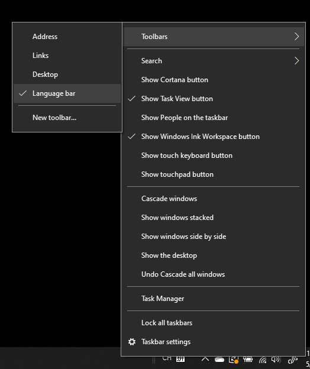

# Skjul, vis eller nulstil værktøjslinjen SprogHide, display, or reset the language bar

**Sådan minimerer du værktøjslinjen Sprog:****To minimize the language bar:**

Du kan klikke på knappen Minimer i øverste højre hjørne på værktøjslinjen Sprog.You can click the minimize button on the top right corner of the language bar. Eller du kan blot trække værktøjslinjen Sprog til proceslinjen, hvilket automatisk minimerer den.Or, you can just drag the language bar to the task bar, which will automatically minimize it.

**Sådan popper du værktøjslinjen Sprog ud:****To pop out the language bar:**

Hvis du ikke vil fastgøre værktøjslinjen Sprog på proceslinjen, skal du højreklikke på en tom plads på proceslinjen og fjerne markeringen af indstillingen **-værktøjslinjen Sprog** i menuen Værktøjslinjer.If you don't want to dock the language bar in the taskbar, right-click any empty space in the taskbar, and uncheck the **Language bar** option in the Toolbars menu. Dette får værktøjslinjen Sprog til at blive vist uden for proceslinjen, ligesom det forrige skærmbillede.This will make the language bar appear outside the taskbar, just like the previous screenshot.

**Sådan gendanner du værktøjslinjen sprog som standard:****To restore the language bar to default:**

Højreklik på sprogknappen på værktøjslinjen, og klik på **Gendan værktøjslinjen Sprog** i menuen.Right-click the language button in the toolbar, and click **Restore the language bar** option in the menu. Dette gendanner den som standard.This will restore it to default.

