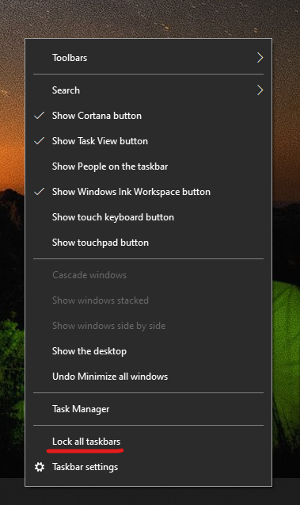

# Flytte proceslinjen til en eller flere sider i toppen af skrivebordet

Du skal først bekræfte, at proceslinjen er låst op. Du kan finde ud af, om den er låst op, ved at højreklikke på et tomt område på proceslinjen og se, om **låse proceslinjen** har en markering ud for. Hvis der er en markering, er proceslinjen låst og kan ikke flyttes. Hvis du klikker på **Lås proceslinjen** , kan du låse den op og fjerne markeringen.

Hvis du har flere skærme, der viser proceslinjen, kan du se **låse alle proceslinjer**.

Når proceslinjen er låst op, kan du trykke på og holde tom plads på proceslinjen og trække den til den ønskede placering på skærmen. Du kan også gøre det ved at højreklikke på et tomt område på proceslinjen og gå til ** [Indstillinger for proceslinjen](ms-settings:taskbar?activationSource=GetHelp) > proceslinjens placering på skærmen**.
