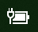

# Der mangler strøm- eller batteriikon i Windows 10

Hvis din Windows 10-enhed har et batteri (f.eks. bærbar computer eller tablet eller en pc, der er sluttet via USB til en UPS), vises normalt et ikon for strøm/batteri på proceslinjen i nærheden af uret, f.eks.:

Hvis du ikke kan se dette ikon, kan det være skjult:

1. Gå til **[Indstillinger > Tilpasning > proceslinjen](ms-settings:taskbar?activationSource=GetHelp)**.

2. I meddelelsesområdet skal du klikke på **Vælg, hvilke ikoner der skal vises på proceslinjen.**

3. Find **power-elementet** på listen, og skift indstillingen til **Til**.

    

**Fejlfinding**

Hvis du har fulgt vejledningen ovenfor, og til/fra-knappen Tænd/slud er nedtonet eller  ikke synlig, skal du skrive Enhedshåndtering i søgefeltet på proceslinjen og derefter vælge Enhedshåndtering på listen over resultater.  Under **Batterier skal** du højreklikke på batteriet til din enhed, klikke på **Deaktiver** og klikke på **Ja**. Vent et par sekunder, og højreklik derefter på batteriet, og klik på **Aktivér.** Genstart derefter enheden.

Hvis du har fulgt vejledningen ovenfor, men batteriikonet ikke vises på proceslinjen, skal du skrive  Jobliste i søgefeltet på proceslinjen og derefter klikke på Jobliste på listen over resultater. På fanen **Processer** under Navn skal **du** højreklikke på **Stifinder** og derefter klikke på **Genstart.**
