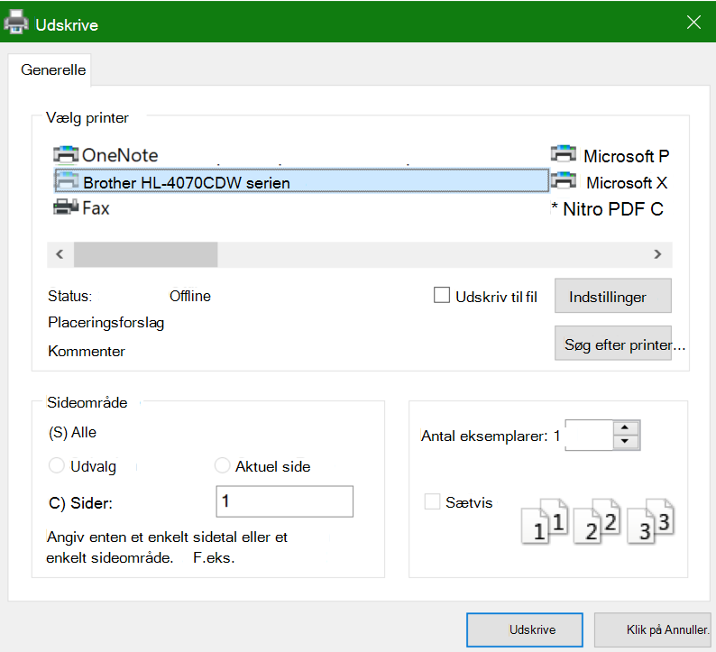

# Udskrivning på begge sider af papiret (dupleksudskrivning)

**Kan min printer udskrive dupleks?**

Printerens funktionsoversigt eller manual skal fortælle dig, om den er i stand til at udskrive på begge sider af papiret, også kaldet "dupleksudskrivning". Hvis du har Microsoft Office, kan du finde en anden måde at finde ud af det på ved at åbne en Office-app som Word eller Excel, gå til **Fil > Udskriv,** sikre, at den rigtige printer er valgt, og søge efter funktionen i afsnittet Indstillinger. Det kan f.eks. være: 

**Dupleksudskrivning i Microsoft Office**

Hvis printeren kan udskrive på begge sider, vil du, når du går til **Fil > Udskriv** i Office-appen, se en indstilling til "Udskriv på begge sider", som vist i eksemplet ovenfor.  Vælg den ønskede type dupleksudskrivning (vend på lang kant eller spejlvend på kort kant), og klik på **Udskriv** for at starte udskriften.

**Dupleksudskrivning fra ethvert program**

I mange apps, når du udskriver, vil du se en generel udskriftsdialog, der ser sådan ud: 

Kontroller, at den rigtige printer er markeret, og klik derefter på **Indstillinger** for at åbne vinduet printerindstillinger. Hvis printeren kan udskrive dupleks, vises muligheden for at aktivere dette for det aktuelle udskriftsjob i det pågældende vindue.
