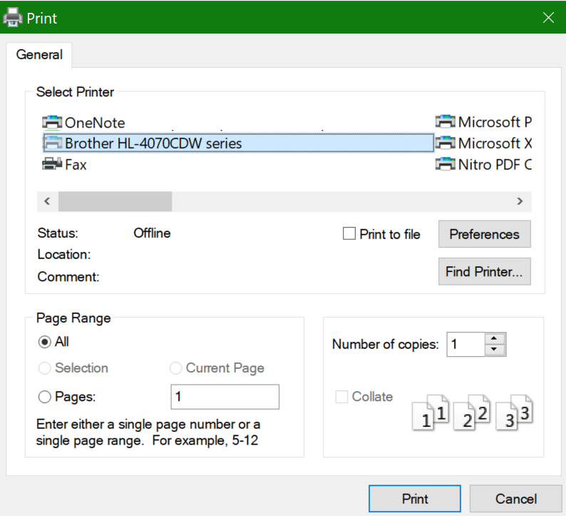

# Udskrivning på begge sider af papiret (duplexudskrivning)

**Kan min printer duplexudskrivning?**

Printerens funktionsoversigt eller manuelle skal fortælle dig, om den kan udskrive på begge sider af papiret, også kaldet "duplexudskrivning". Hvis du har Microsoft Office, kan du også finde ud af det ved at åbne en Office-app som f.eks. Word eller Excel, gå til Filer **>** Udskriv , sørge for, at den rigtige printer er valgt, og kigge efter muligheden i sektionen Indstillinger. Eksempel: 

**Duplexudskrivning i Microsoft Office**

Hvis din printer kan udskrive på begge sider, når du går til Filer **> Udskriv** i Office-appen, får du vist indstillingen "Udskriv på begge sider", som vist i eksemplet ovenfor.  Vælg den ønskede type duplexudskrivning (spejlvend på den lange kant, eller spejlvend på den korte kant), og klik på **Udskriv** for at starte udskriften.

**Duplexudskrivning fra et hvilket som helst program**

I mange apps, når du udskriver, får du vist en generel udskrivningsdialogboks, der ser sådan ud: 

Sørg for, at den rigtige printer er valgt, og klik derefter **på Indstillinger** for at åbne vinduet med printerindstillinger. Hvis printeren kan duplexudskrivning, vises muligheden for at aktivere dette for det aktuelle udskriftsjob i det pågældende vindue.
