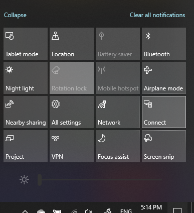

# Projicer til en pc

På din destinationsenhed (projicering til) skal du søge efter "Projektion-indstillinger" for at åbne siden Indstillinger **for Projicering til denne pc.** Sørg derefter for, at:
- "Nogle Windows- og Android-enheder kan projicer til denne pc, når du siger, at det er OK"-rullemenuen er indstillet til **Altid slået fra**.
- Rullemenuen "Bed om at projice til denne pc" er indstillet **til Hver gang der kræves en forbindelse.**
- Rullemenuen "Kræv pinkode til parring" er indstillet til **Aldrig.**

På destinationsenheden skal du starte **Forbind-appen** ved at gå **til Start** og søge efter "Opret forbindelse".

Derefter skal du på din kildeenhed, du forsøger at projice fra:

1. Tryk **på Windows-tasten + A** for at åbne Handlingscenter.
2. Klik **på Opret forbindelse**.
3. Klik på den enhed, du vil projicer skærmen til.

Efter ovenstående trin bør destinationsenheden vise skærmbilledet for kildeenheden, som om det var en sekundær skærm.
