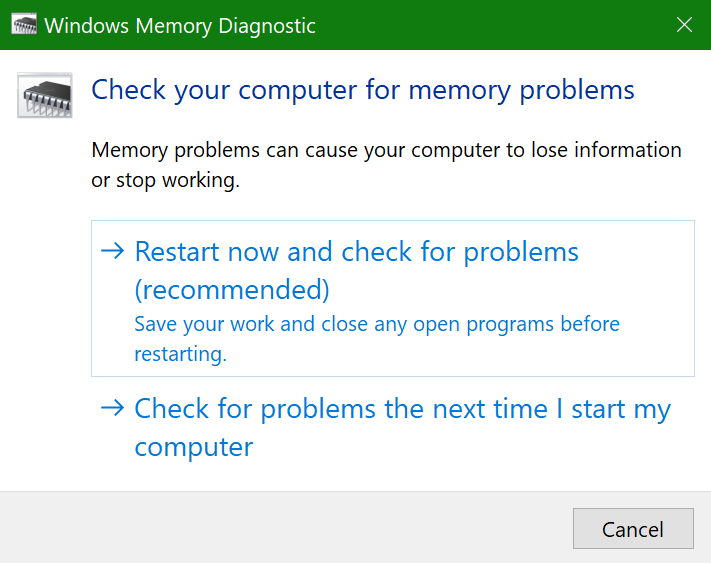
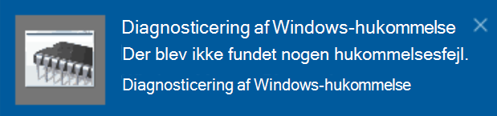

# Køre Windows Hukommelsesdiagnosticering i Windows 10Run Windows Memory Diagnostics in Windows 10

Hvis Windows og apps på din pc går ned, fryser eller handler ustabilt, kan du have et problem med pc'ens hukommelse (RAM).If Windows and apps on your PC are crashing, freezing, or acting in an unstable manner, you may have a problem with the PC’s memory (RAM). Du kan køre Windows Hukommelsesdiagnosticering for at kontrollere, om der er problemer med pc'ens RAM.You can run the Windows Memory Diagnostic to check for problems with the PC’s RAM.

Skriv **hukommelsesdiagnosticering**i søgefeltet på proceslinjen, og vælg derefter **Windows Hukommelsesdiagnosticering**.In the search box on your taskbar, type **memory diagnostic**, and then select **Windows Memory Diagnostic**. 

Hvis du vil køre diagnosticeringen, skal pc'en genstartes.To run the diagnostic, the PC needs to restart. Du har mulighed for at genstarte med det samme (gem dit arbejde og luk åbne dokumenter og e-mails først), eller planlæg, at diagnosticeringen skal køre automatisk, næste gang pc'en genstarter:You have the option to restart immediately (please save your work and close open documents and e-mails first), or schedule the diagnostic to run automatically the next time the PC restarts:

Når pc'en genstartes, kører **Windows Hukommelsesdiagnosticering** automatisk.When the PC restarts, the **Windows Memory Diagnostics Tool** will run automatically. Status og status vises, mens diagnosticeringen kører, og du har mulighed for at annullere diagnosticeringen ved at trykke på **ESC-tasten** på tastaturet.Status and progress will be displayed as the diagnostics run, and you have the option of cancelling the diagnostics by hitting the **ESC** key on your keyboard.

Når diagnosticeringen er fuldført, starter Windows normalt.When the diagnostics are complete, Windows will start normally.
Umiddelbart efter genstartvises der en meddelelse (ud for ikonet **Løsningscenter** på proceslinjen) umiddelbart efter genstarten for at angive, om der er fundet hukommelsesfejl.Immediately after restart, when the Desktop appears, a notification will appear (next to the **Action Center** icon on the taskbar), to indicate whether any memory errors were found. Det kan f.eks. være:For example:

Her er ikonet Løsningscenter:Here's the Action Center icon:  

Og en prøve anmeldelse:And a sample notification: 

Hvis du ikke har modtaget meddelelsen, kan du vælge ikonet **Løsningscenter** på proceslinjen for at få vist **Løsningscenter** og se en liste over meddelelser, der kan rulles igennem.If you missed the notification, you can select the **Action Center** icon  on the taskbar to display the **Action Center** and see a scrollable list of notifications.

Hvis du vil gennemse detaljerede oplysninger, skal du skrive **hændelse** i søgefeltet på proceslinjen og derefter vælge **Logbog**.To review detailed information, type **event** into the search box on your taskbar, and then select **Event Viewer**. Gå til **Windows Logs > System**i **logbogs**venstre rude .In the **Event Viewer**’s left-hand pane, navigate to **Windows Logs > System**. Skan ned på listen i højre rude, mens du ser på kolonnen **Kilde,** indtil du ser hændelser med Kildeværdien **MemoryDiagnostics-Results**.In the right-hand pane, scan down the list while looking at the **Source** column, until you see events with Source value **MemoryDiagnostics-Results**. Fremhæv hver af disse hændelser, og se resultatoplysningerne i feltet under fanen **Generelt** under listen.Highlight each such event and see the result information in the box under the **General** tab below the list.
