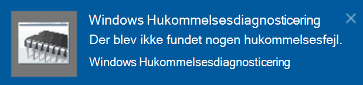

# Kør Windows Memory Diagnostics i Windows 10

Hvis Windows og apps på din pc går ned, fryser eller fungerer ustabilt, kan der være et problem med pc'ens hukommelse (RAM). Du kan køre Windows Memory Diagnostic for at kontrollere, om der er problemer med pc'ens RAM.

Skriv hukommelsesdiagnosticering i **søgefeltet på proceslinjen,** og vælg derefter **Windows Memory Diagnostic**. 

Pc'en skal genstartes for at køre diagnosticeringen. Du har mulighed for at genstarte med det samme (gem dit arbejde, og luk åbne dokumenter og mails først), eller planlæg diagnosticeringen til at køre automatisk, næste gang pc'en genstarter:

Når pc'en genstartes, **Windows Værktøjet Hukommelsesdiagnosticering** automatisk. Status og status vises i diagnosticeringsværktøjet, og du kan annullere diagnosticeringen ved at trykke på **Esc** på tastaturet.

Når diagnosticeringen er fuldført, Windows starte normalt.
Straks efter genstart, når skrivebordet vises, vises der  en meddelelse (ud for ikonet Handlingscenter på proceslinjen) for at angive, om der blev fundet hukommelsesfejl. Eksempel:

Her er ikonet Handlingscenter:  

Og en eksempelmeddelelse: 

Hvis du ikke når at  se meddelelsen, kan du  vælge ikonet handlingscenter på proceslinjen for at få vist Handlingscenter og få vist en liste over meddelelser, der kan rulles i.

Hvis du vil gennemse detaljerede oplysninger, **skal** du skrive begivenhed i søgefeltet på proceslinjen og derefter vælge **Log på**. I **ruden til** venstre for Logbog skal du gå til **Windows logfiler > System.** I højre rude skal du rulle ned på  listen, mens du kigger på kolonnen Kilde, indtil du ser hændelser med kildeværdien **MemoryDiagnostics-Results.** Fremhæv hver enkelt begivenhed, og få vist resultatoplysningerne i feltet under **fanen** Generelt under listen.
