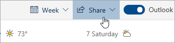

# Dele med Outlook på internettetSharing with Outlook on the web

Vælg **Del**på værktøjslinjen øverst på siden i din kalender, og vælg den kalender, du vil dele.From your Calendar, on the toolbar at the top of the page, select **Share**, and choose the calendar you want to share.

    

**Bemærk:** Du kan ikke dele kalendere, der ejes af andre.**Note**: You can't share calendars owned by other people.

- Angiv navnet eller mailadressen på den person, du vil dele din kalender med.Enter the name or email address of the person you want to share your calendar with.
- Vælg, hvordan personen skal bruge din kalender:Choose how you want the person to use your calendar:
    - **Kan se, når jeg er optaget**   giver dem mulighed for at se, når du er optaget, men ikke indeholder oplysninger som hændelsesplaceringen.**Can view when I'm busy** lets them see when you're busy but doesn't include details like the event location.
    - **Kan se titler og placeringer**   giver dem mulighed for at se, når du har travlt, samt titlen og placeringen af begivenheder.**Can view titles and locations** lets them see when you're busy, as well as the title and location of events.
    - **Kan se alle detaljer**   lader dem se alle detaljerne i dine begivenheder.**Can view all details** lets them see all the details of your events.
    - **Kan redigere**   lader dem redigere din kalender.**Can edit** lets them edit your calendar.
    - **Deleger**   giver dem mulighed for at redigere din kalender og dele den med andre.**Delegate** lets them edit your calendar and share it with others.
- Vælg **Del**.Select **Share**.
