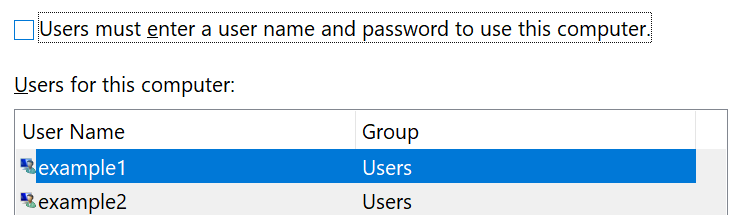

# Logge på Windows 10 uden at bruge en adgangskodeSign-in to Windows 10 without using a password

Hvis du vil undgå at skulle skrive en adgangskode ved start af Windows, anbefaler vi, at du bruger en af de Secure-logonindstillinger til Windows Hello, som en pinkode, ansigtsgenkendelse eller fingeraftryk, hvis det er muligt.To avoid having to type a password at Windows startup, we recommend you use one of the Windows Hello secure sign-in options, like a PIN, face recognition, or fingerprint, if available. Hvis du er sikker på, at du vil deaktivere Secure logon, skal du se instruktionerne "Log automatisk på Windows 10" nedenfor.If you really want to disable secure sign-in, see the "Automatically sign in to Windows 10" instructions below.

**Sikre Windows Hello-alternativer til kontoens adgangskode****Secure Windows Hello alternatives to the account password**

Gå til **indstillinger > konti > indstillinger for logon** (eller klik [her](ms-settings:signinoptions?activationSource=GetHelp)).Go to **Settings  > Accounts > Sign-in options** (or click [here](ms-settings:signinoptions?activationSource=GetHelp)). Tilgængelige logonindstillinger vises.Available sign-in options will be listed. Det kan f.eks. være:For example:

Klik eller tryk på en af indstillingerne for at konfigurere den.Click or tap one of the options to configure it. Næste gang du starter eller låser Windows op, kan du bruge den nye indstilling i stedet for en adgangskode.Next time you start or unlock Windows, you will be able to use the new option instead of a password. 

**Logge på Windows 10 automatisk****Automatically sign-in to Windows 10**

**Bemærk**! det er praktisk at logge på automatisk logon, men det introducerer en sikkerhedsrisiko, især hvis din pc er tilgængelig for flere personer.**Note**: Automatic sign-in is convenient, but introduces a security risk, especially if your PC is accessible by multiple people. 

1. Klik eller tryk på knappen **Start** på proceslinjen.Click or tap the **Start** button in the Taskbar.

2. Skriv **netplwiz** , og tryk på ENTER for at åbne vinduet brugerkonti.Type **netplwiz** and hit the Enter key to open the User Accounts window.

3. I **brugerkonti**skal du klikke på den konto, du automatisk vil logge på, når Windows starter.In **User Accounts**, click the account you want to automatically sign in to when Windows starts.

4. Fjern markeringen i afkrydsningsfeltet "brugerne skal angive et Brugernavn og en adgangskode for at bruge denne computer".Uncheck the "Users must enter a user name and password to use this computer" checkbox.

    

5. Klik på **OK**.Click **OK**. Du bliver bedt om at angive og bekræfte adgangskoden for den konto, du har valgt.You will be asked to enter and confirm the password for the account you selected. Klik på **OK** for at afslutte.Click **OK** to finish. Næste gang Windows 10 starter, bliver den automatisk logget på den konto, du har valgt.Next time Windows 10 starts, it will automatically sign in to the account you selected.
