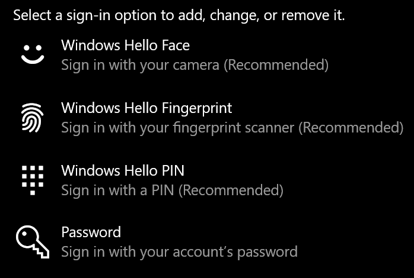

# Log på Windows 10 uden at bruge en adgangskode

Hvis du vil undgå at skulle skrive en adgangskode ved start af Windows, anbefaler vi, at du bruger en af de sikre logonindstillinger i Windows Hello, f.eks. Hvis du virkelig vil deaktivere sikker logon, skal du se vejledningen "Log automatisk på Windows 10" nedenfor.

**Sikre Alternativer til Windows Hello til adgangskoden til kontoen**

Gå til **Indstillinger > konti > logonindstillinger** (eller klik [her](ms-settings:signinoptions?activationSource=GetHelp)). Tilgængelige logonindstillinger vises. Det kan f.eks. være:

Klik eller tryk på en af indstillingerne for at konfigurere den. Næste gang du starter eller låser Windows op, kan du bruge den nye indstilling i stedet for en adgangskode. 

**Log på Windows 10 automatisk**

**Bemærk:** Automatisk login er praktisk, men indfører en sikkerhedsrisiko, især hvis din pc er tilgængelig for flere personer. 

1. Klik eller tryk på knappen **Start** på proceslinjen.

2. Skriv **netplwiz,** og tryk på enter for at åbne vinduet Brugerkonti.

3. Klik på den konto, du automatisk vil logge på, når Windows starter, i **Brugerkonti.**

4. Fjern markeringen i afkrydsningsfeltet "Brugere skal angive et brugernavn og en adgangskode for at bruge denne computer".

    

5. Klik på **OK**. Du bliver bedt om at indtaste og bekræfte adgangskoden til den konto, du har valgt. Klik på **OK** for at afslutte. Næste gang Windows 10 starter, logges den automatisk på den konto, du har valgt.
