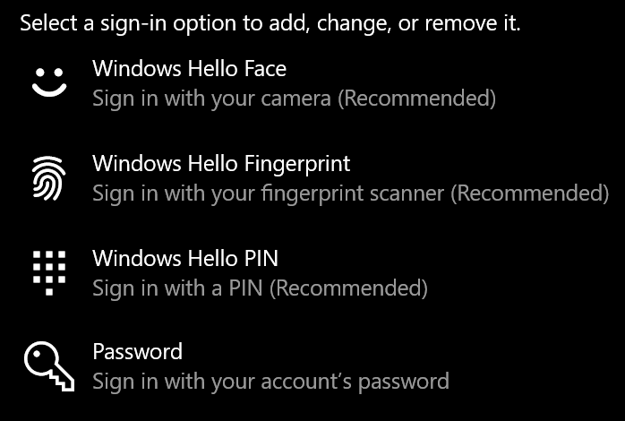
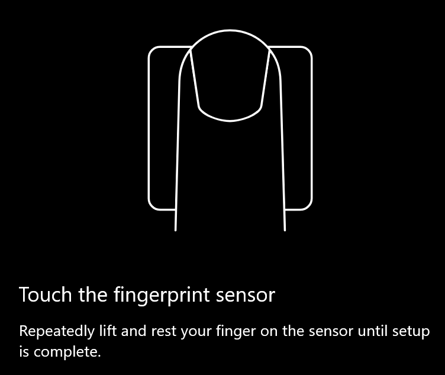
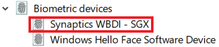

# Brug indstillingen til fingeraftrykslåsning i Windows 10

**Aktivér Windows Hello fingeraftryk**

Hvis du Windows 10 låse op ved hjælp af dit fingeraftryk, skal du konfigurere Windows Hello Fingerprint ved at tilføje (så Windows lærer at genkende) mindst én finger. 

1. Gå til **Indstillinger > konti > logonindstillinger** (eller klik [her).](ms-settings:signinoptions?activationSource=GetHelp) De tilgængelige indstillinger for logon vises. Eksempel:

    

2. Klik eller tryk **Windows Hello fingeraftryk,** og klik derefter **på Konfigurer**. Klik på Windows Hello i **konfigurationsvinduet.** Fingeraftrykssensoren aktiveres, og du vil blive bedt om at placere din finger på sensoren:

   

3. Følg vejledningen, som beder dig om at scanne din finger gentagne gange. Når dette er afsluttet, har du mulighed for at tilføje andre fingre, som du kan bruge til at logge på med. Næste gang du logger på Windows 10, har du mulighed for at bruge dit fingeraftryk til at gøre det.

**Windows Hello Fingeraftryk er ikke tilgængeligt som logonindstilling**

Hvis **Windows Hello-fingeraftryk** ikke vises som en indstilling under Logonindstillinger, betyder det, at Windows ikke er opmærksom på nogen fingeraftrykslæser/scanner, der er tilsluttet din pc, eller at en systempolitik forhindrer brugen af den (hvis din pc f.eks. administreres af arbejdspladsen). Sådan foretager du fejlfinding: 

1. Vælg knappen **Start** på proceslinjen, og søg efter **Enhedshåndtering**.

2. Klik eller tryk for at **åbne Enhedshåndtering**.

3. I Enhedshåndtering skal du udvide biometriske enheder ved at klikke på dens vinkel.

   

4. Din fingeraftryksscanner skal angives som en biometrisk enhed, f.eks. Synaptics WBDI-scanneren:

   

5. Hvis din fingeraftryksscanner ikke vises, og scanneren er integreret i din pc, skal du gå til pc-producentens websted. I afsnittet teknisk support til din pc-model skal du søge efter en Windows 10 efter en scanner, du kan installere.

6. Hvis scanneren er adskilt fra pc'en (tilsluttet via USB), skal du gå til scannerproducentens websted for at finde og installere Windows 10-enhedsdriversoftware til den scannermodel, du har.
