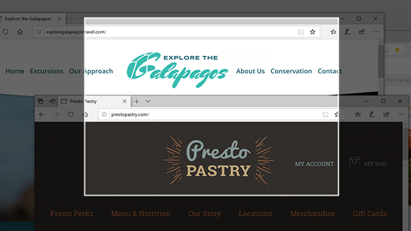
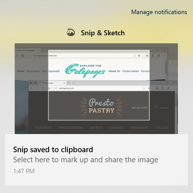

# Brug klip & skitser til at tage, markere og dele billeder

Skærm skitsen hedder nu **klip & skitser**. **Hvis du hurtigt vil tage et klip**:

1. Tryk på **Windows-tasten + Skift + S**. Du får vist din skærm mørkere, og markøren vises som et kryds. 

2. Vælg et punkt på kanten af det område, du vil kopiere, og venstreklik på markøren. 

3. Flyt markøren for at fremhæve det område, du vil hente. Det område, du registrerer, vises på skærmen.

   

Det billede, du har afklippet, gemmes i din Udklipsholder, som er klar til at indsætte i en mail eller et dokument. 

**Hvis du vil redigere eller få vist billedet**: 

- Klik på meddelelses ikonet yderst til højre på proceslinjen. Klik derefter på det billede, du lige har hentet. Dit klip åbnes i appen klip & skitser.

   
