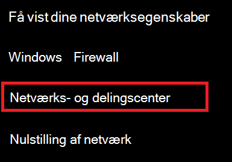
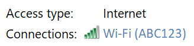
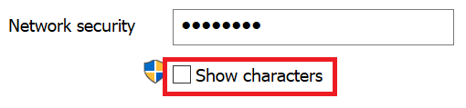

# Vis Wi-Fi adgangskoden til netværket i Windows 10View Wi-Fi network password in Windows 10

1. Sørg for, at din Windows 10-pc er tilsluttet Wi-Fi netværket.Make sure your Windows 10 PC is connected to the Wi-Fi network.

2. Gå til **Indstillinger > Netværksforbindelse & status** for > , eller  klik eller tryk her for at lade os tage dig dertil nu.Go to **Settings  > Network & Internet  > Status**, or click or tap [here](ms-settings:network?activationSource=GetHelp) to let us take you there now.)

3. Klik **på Netværks- og delingscenter**.Click **Network and Sharing Center**.

    

4. I **Netværks- og delingscenter** ud **for Forbindelser** kan du se navnet på dit trådløse netværk.In **Network and Sharing Center**, next to **Connections**, you will see the name of your wireless network. Hvis dit netværk f.eks. hedder "ABC123", får du muligvis vist:For example, if your network is named "ABC123," you might see:

    

    Klik på navnet på det trådløse netværk for at Wi-Fi statusvinduet.Click the wireless network name to open the Wi-Fi Status window. 

5. I vinduet Wi-Fi skal du klikke på **Trådløse egenskaber,** klikke på **fanen** Sikkerhed og markere **Vis tegn**.In the Wi-Fi Status window, click **Wireless Properties**, click the **Security** tab, and check **Show characters**.

    

