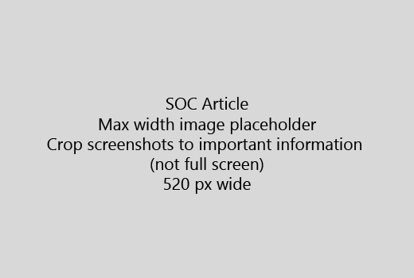

Start din artikel med en meget kort introduktion (1 punktum). Sætte dig selv i læserens sted - Hvorfor er de her? Hvad gør de? 
  
1. Gå direkte til en hurtig oversigt over trin for at udføre opgaven.
    
    Hvis du har brug at forklare et begreb, eller de har at gøre forhånd nødvendige trin, kan du tilføje en hurtig oversigt under det trin, hvor de har brug for det og [link](https://support.office.com/article/f37e7984-cf03-4fde-92d3-82970d7e241b.aspx) til begrebet eller trin. 
    
2. Holde procedurer kort - helst 5 eller færre trin, mere end 8.
    
3. Brug **format til brugergrænsefladen** for elementer på brugergrænsefladen eller for tekst, brugerne skal angive. 
    
4. Brug verberne vælge, vælger, eller Angiv som aktioner og formatere menuer som **i menuen** \> **kommando**.
    
5. Tilføj eventuelt et skærmbillede for kontekst (hvis Brugergrænsefladen er svært at finde, eller der er behov at fuldføre opgaven).
    
    Største bredde: 520 pixel. Brug en standard tema, ikke vise personlige oplysninger, og Beskær for at vise kun, hvad der er relevant. 
    
    
  
Hvis du vil tilføje en video eller et skærmbillede, bruge et gitter med to kolonner og have trinnene i venstre og video eller skærmbillede til højre - se [Eksempel på video gitter og trin](https://support.office.com/article/14ce8e82-efa0-47f5-bb84-94f078db3dae.aspx). 
  
Fokusere på mere end 500 ord for en artikel.
  
# Eksempel-artikel

[Ændre mit foto](https://support.office.com/article/555376e0-1fca-49ba-8434-307a0525c767.aspx)
  

